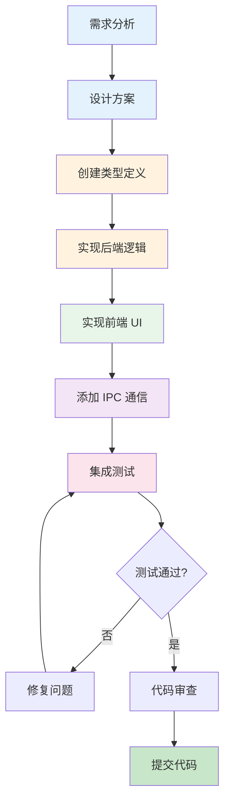
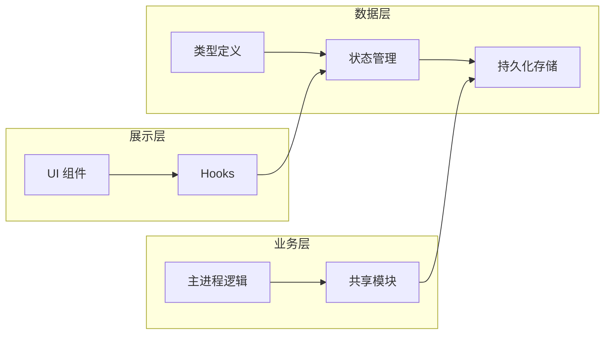
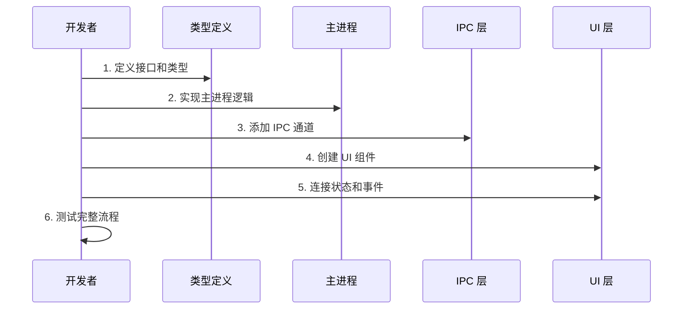
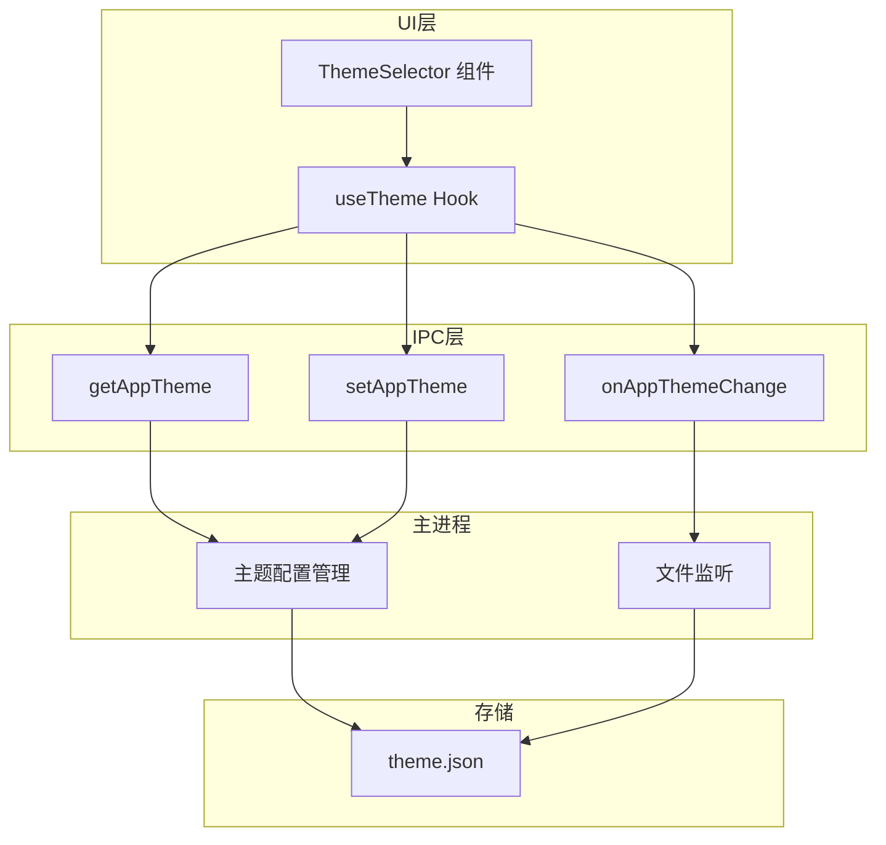
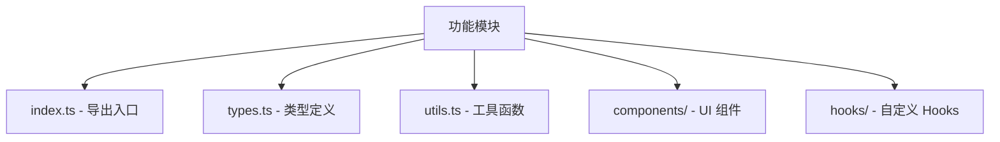
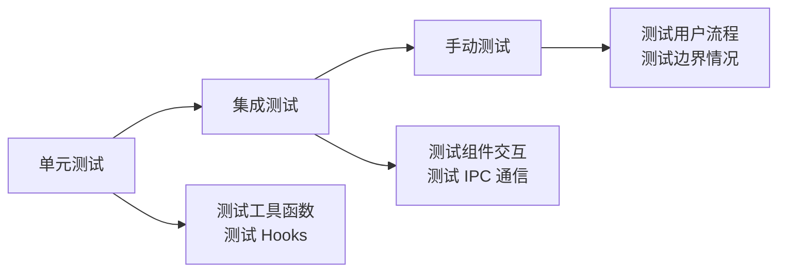

# 添加新功能指南

本文档教你如何从零开始添加一个新功能。

## 📋 目录

- [功能开发流程](#功能开发流程)
- [功能类型与模板](#功能类型与模板)
- [实战案例：添加主题切换功能](#实战案例添加主题切换功能)
- [最佳实践](#最佳实践)

---

## 功能开发流程

### 整体流程图



### 各阶段详细说明

#### 1. 需求分析

明确功能的目标：
- 功能解决什么问题？
- 用户如何使用这个功能？
- 需要哪些数据？

#### 2. 设计方案

设计数据流和组件结构：



#### 3. 实现步骤



---

## 功能类型与模板

### 类型一：纯 UI 功能

**特点**: 不涉及主进程，只在渲染进程内

**文件位置**: `apps/electron/src/renderer/`

**模板：**

```tsx
// 1. 创建组件: components/MyFeature.tsx
import { useState } from 'react'

export function MyFeature() {
  const [value, setValue] = useState('')
  
  return (
    <div className="p-4">
      <input 
        value={value}
        onChange={(e) => setValue(e.target.value)}
      />
    </div>
  )
}

// 2. 在页面中使用
import { MyFeature } from '@/components/MyFeature'

// 在 JSX 中
<MyFeature />
```

### 类型二：需要持久化的功能

**特点**: 需要保存数据到磁盘

**涉及文件：**
1. 类型定义: `packages/core/src/` 或 `apps/electron/src/shared/types.ts`
2. 配置管理: `packages/shared/src/config/`
3. 主进程处理: `apps/electron/src/main/`

**模板：**

```typescript
// 1. 类型定义 (shared/types.ts)
export interface MyFeatureConfig {
  enabled: boolean
  value: string
}

// 2. 配置管理 (packages/shared/src/config/my-feature.ts)
export async function loadMyFeatureConfig(
  workspaceId: string
): Promise<MyFeatureConfig> {
  const configPath = path.join(
    getWorkspacePath(workspaceId),
    'my-feature.json'
  )
  // 读取并解析配置...
}

// 3. 主进程 IPC 处理 (main/ipc.ts)
ipcMain.handle('get-my-feature-config', async (_, workspaceId) => {
  return loadMyFeatureConfig(workspaceId)
})

// 4. 预加载脚本暴露 API (preload/index.ts)
const api = {
  // ...
  getMyFeatureConfig: (workspaceId: string) => 
    ipcRenderer.invoke('get-my-feature-config', workspaceId)
}

// 5. 渲染进程使用 (hooks/useMyFeature.ts)
export function useMyFeature(workspaceId: string) {
  const [config, setConfig] = useState<MyFeatureConfig | null>(null)
  
  useEffect(() => {
    window.electronAPI.getMyFeatureConfig(workspaceId)
      .then(setConfig)
  }, [workspaceId])
  
  return { config }
}
```

### 类型三：需要 Agent 交互的功能

**特点**: 需要与 AI Agent 进行交互

**涉及文件：**
1. Agent 工具: `packages/shared/src/agent/`
2. MCP 服务器: `packages/session-mcp-server/` 或 `packages/bridge-mcp-server/`

**模板：**

```typescript
// 1. 定义工具 (packages/shared/src/agent/my-tool.ts)
export const myToolDefinition = {
  name: 'my_tool',
  description: '执行某个操作',
  input_schema: {
    type: 'object',
    properties: {
      param: { type: 'string', description: '参数说明' }
    },
    required: ['param']
  }
}

// 2. 实现工具处理函数
export async function handleMyTool(
  params: { param: string }
): Promise<string> {
  // 执行操作...
  return '结果'
}
```

---

## 实战案例：添加主题切换功能

### 需求

用户可以在应用级别切换不同的颜色主题。

### 设计



### 实现步骤

#### 步骤 1：定义类型

```typescript
// apps/electron/src/shared/types.ts
export interface ThemeOverrides {
  name: string
  colors: {
    primary: string
    background: string
    foreground: string
    // ...
  }
}
```

#### 步骤 2：主进程实现

```typescript
// apps/electron/src/main/theme-manager.ts
import { ipcMain } from 'electron'
import { readJSON, writeJSON } from 'fs-extra'

const THEME_PATH = path.join(app.getPath('userData'), 'theme.json')

export function initThemeHandlers() {
  // 获取主题
  ipcMain.handle('get-app-theme', async () => {
    try {
      return await readJSON(THEME_PATH)
    } catch {
      return null // 返回默认主题
    }
  })
  
  // 设置主题
  ipcMain.handle('set-app-theme', async (_, theme: ThemeOverrides) => {
    await writeJSON(THEME_PATH, theme)
    // 通知所有窗口主题已更改
    BrowserWindow.getAllWindows().forEach(win => {
      win.webContents.send('app-theme-changed', theme)
    })
  })
}
```

#### 步骤 3：预加载脚本

```typescript
// apps/electron/src/preload/index.ts
const api = {
  // ...
  getAppTheme: () => ipcRenderer.invoke('get-app-theme'),
  setAppTheme: (theme: ThemeOverrides) => 
    ipcRenderer.invoke('set-app-theme', theme),
  onAppThemeChange: (callback: (theme: ThemeOverrides) => void) => {
    const handler = (_: any, theme: ThemeOverrides) => callback(theme)
    ipcRenderer.on('app-theme-changed', handler)
    return () => ipcRenderer.removeListener('app-theme-changed', handler)
  }
}
```

#### 步骤 4：创建 Hook

```typescript
// apps/electron/src/renderer/hooks/useTheme.ts
export function useTheme({ appTheme }: { appTheme: ThemeOverrides | null }) {
  const [theme, setTheme] = useState(appTheme)
  
  // 应用主题到 CSS 变量
  useEffect(() => {
    if (theme) {
      Object.entries(theme.colors).forEach(([key, value]) => {
        document.documentElement.style.setProperty(`--${key}`, value)
      })
    }
  }, [theme])
  
  const updateTheme = useCallback(async (newTheme: ThemeOverrides) => {
    await window.electronAPI.setAppTheme(newTheme)
    setTheme(newTheme)
  }, [])
  
  return { theme, updateTheme }
}
```

#### 步骤 5：创建 UI 组件

```tsx
// apps/electron/src/renderer/components/ThemeSelector.tsx
export function ThemeSelector({ themes }: { themes: ThemeOverrides[] }) {
  const { theme, updateTheme } = useTheme()
  
  return (
    <div className="grid grid-cols-3 gap-4">
      {themes.map((t) => (
        <button
          key={t.name}
          onClick={() => updateTheme(t)}
          className={cn(
            "p-4 rounded-lg border",
            theme?.name === t.name && "border-primary"
          )}
        >
          <div 
            className="w-full h-8 rounded"
            style={{ background: t.colors.primary }}
          />
          <span>{t.name}</span>
        </button>
      ))}
    </div>
  )
}
```

---

## 最佳实践

### 1. 代码组织



### 2. 命名规范

| 类型 | 规范 | 示例 |
|------|------|------|
| 组件 | PascalCase | `SessionList.tsx` |
| Hook | use 前缀 | `useSession.ts` |
| 工具函数 | camelCase | `formatDate.ts` |
| 类型 | PascalCase | `SessionConfig` |
| 常量 | UPPER_SNAKE_CASE | `MAX_RETRY_COUNT` |

### 3. 错误处理

```typescript
// 使用 try-catch 处理异步错误
try {
  const result = await someAsyncOperation()
  return result
} catch (error) {
  console.error('操作失败:', error)
  // 返回默认值或抛出自定义错误
  throw new Error('操作失败，请重试')
}
```

### 4. 测试策略



---

## 下一步

- 阅读 [代码结构详解](./CODE_STRUCTURE.md) 了解各模块细节
- 阅读 [调试指南](./DEBUGGING.md) 解决开发中的问题
- 查看 [项目文档](./PROJECT_DOCS.md) 了解更多项目信息
