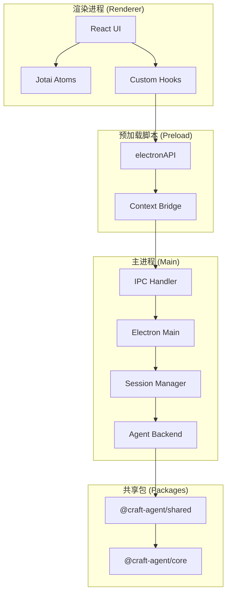
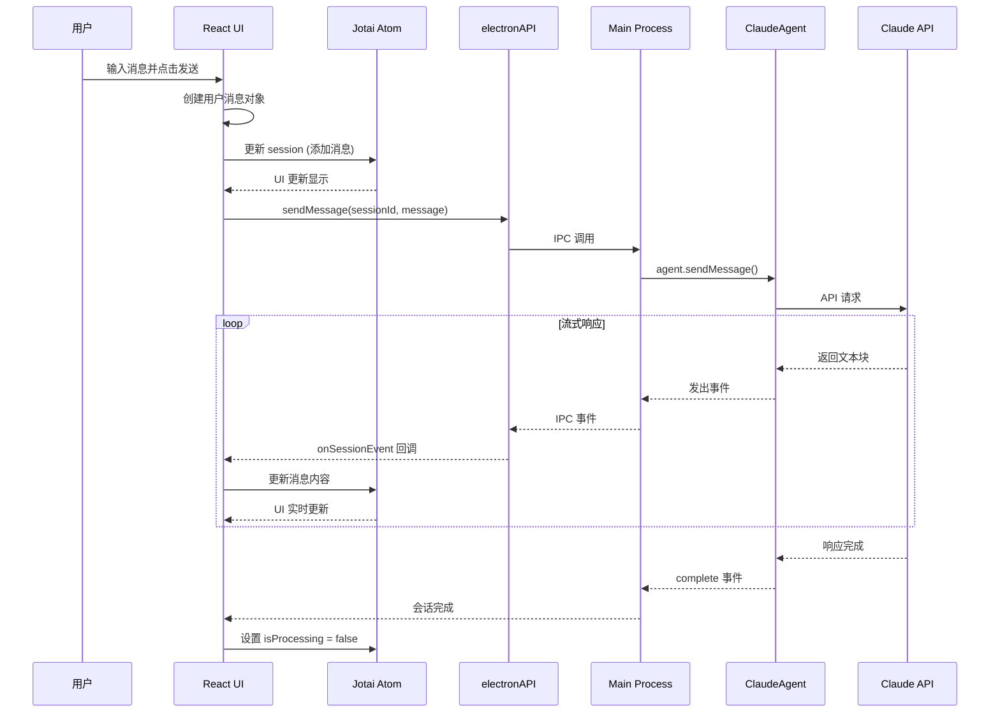
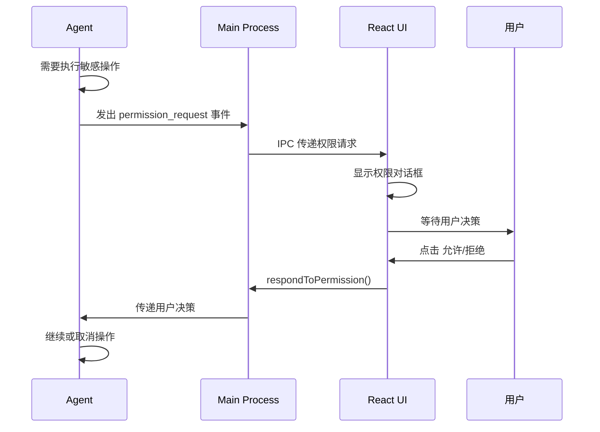
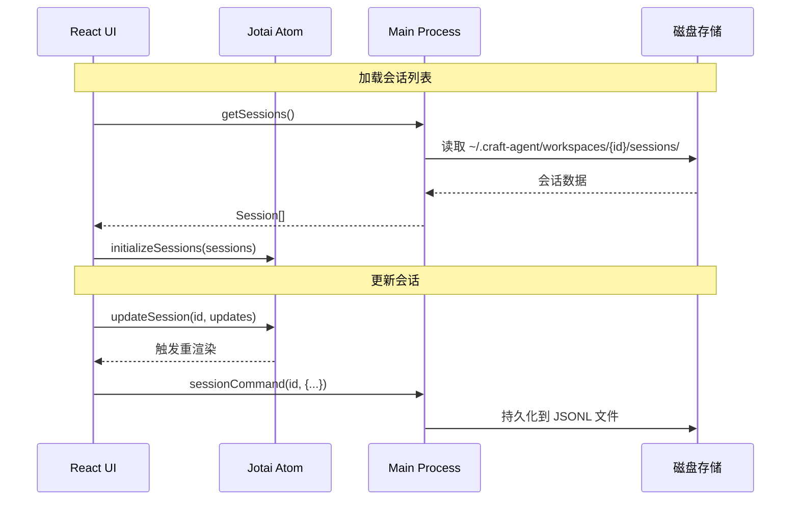
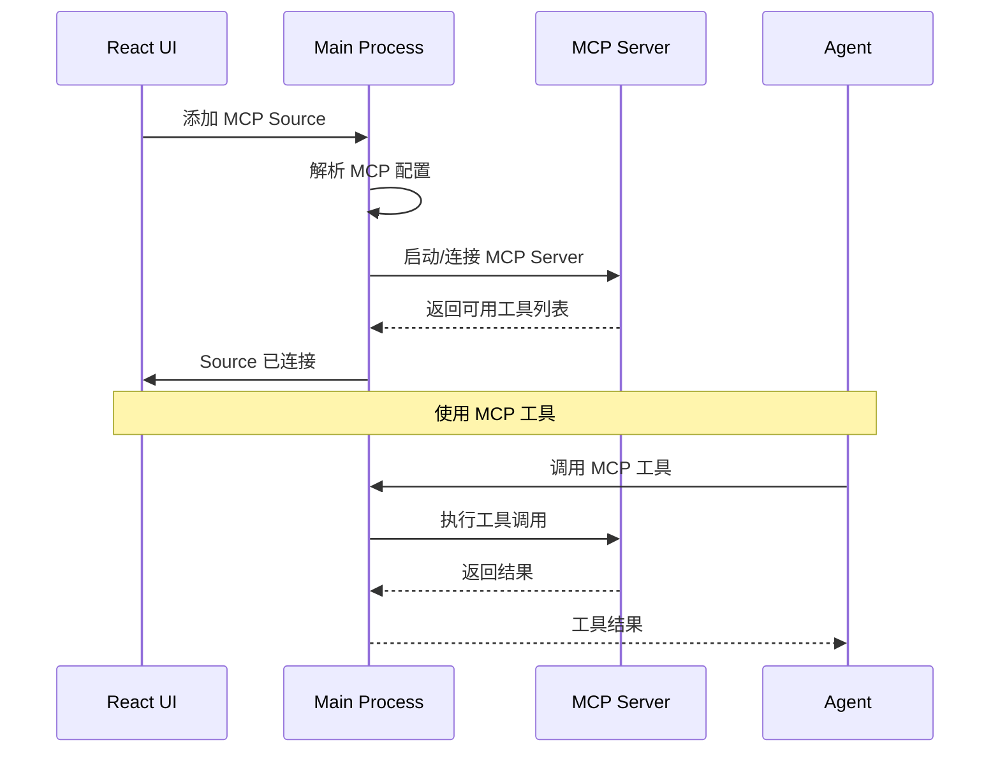

# Craft Agents 项目架构概览

本文档帮助你快速理解 Craft Agents 项目的整体架构，适合开发初学者阅读。

## 📋 目录

- [项目简介](#项目简介)
- [技术栈](#技术栈)
- [目录结构](#目录结构)
- [核心架构](#核心架构)
- [数据流时序图](#数据流时序图)
- [关键概念](#关键概念)

---

## 项目简介

Craft Agents 是一个基于 AI Agent 的桌面应用程序，允许用户与 Claude (Anthropic) 或 Codex (OpenAI) 进行交互式对话。它支持：

- 多会话管理
- MCP (Model Context Protocol) 服务器连接
- 技能 (Skills) 系统
- 数据源 (Sources) 集成
- 权限管理模式

---

## 技术栈

| 层级 | 技术 | 说明 |
|------|------|------|
| **运行时** | [Bun](https://bun.sh/) | 高性能 JavaScript 运行时 |
| **桌面框架** | [Electron](https://www.electronjs.org/) | 跨平台桌面应用 |
| **前端框架** | React 18 | UI 组件库 |
| **状态管理** | Jotai | 原子化状态管理 |
| **UI 组件** | shadcn/ui + Tailwind CSS v4 | 现代化 UI |
| **构建工具** | esbuild + Vite | 快速构建 |
| **AI SDK** | @anthropic-ai/claude-agent-sdk | Claude Agent SDK |
| **加密** | AES-256-GCM | 凭证加密存储 |

---

## 目录结构

```
craft-agents/
├── apps/
│   └── electron/              # Electron 桌面应用 (主入口)
│       └── src/
│           ├── main/          # Electron 主进程
│           │   ├── index.ts   # 应用入口
│           │   ├── ipc.ts     # IPC 通信
│           │   ├── window-manager.ts  # 窗口管理
│           │   └── sessions.ts # 会话管理
│           ├── preload/       # 预加载脚本 (桥接层)
│           │   └── index.ts   # 暴露 API 给渲染进程
│           └── renderer/      # React UI (渲染进程)
│               ├── App.tsx    # 根组件
│               ├── components/  # UI 组件
│               ├── hooks/     # 自定义 Hooks
│               ├── atoms/     # Jotai 状态原子
│               └── pages/     # 页面组件
│
├── packages/
│   ├── shared/                # 共享业务逻辑
│   │   └── src/
│   │       ├── agent/         # Agent 核心 (ClaudeAgent, CodexAgent)
│   │       ├── auth/          # 认证模块
│   │       ├── config/        # 配置管理
│   │       ├── credentials/   # 凭证加密存储
│   │       ├── sessions/      # 会话持久化
│   │       ├── sources/       # 数据源 (MCP, API)
│   │       ├── skills/        # 技能系统
│   │       └── statuses/      # 状态管理
│   │
│   ├── core/                  # 核心类型定义
│   ├── ui/                    # 共享 UI 组件库
│   ├── codex-types/           # Codex 类型定义
│   └── mermaid/               # Mermaid 图表渲染
│
├── i18n/                      # 国际化文件
├── docs/                      # 文档
└── tests/                     # 测试文件
```

---

## 核心架构

### 三层架构



### 进程通信模型

Electron 采用多进程架构：

1. **主进程 (Main Process)**: Node.js 环境，负责系统交互、文件操作、Agent 调用
2. **渲染进程 (Renderer Process)**: 浏览器环境，负责 UI 渲染
3. **预加载脚本 (Preload)**: 安全桥接层，暴露有限的 API 给渲染进程

---

## 数据流时序图

### 1. 用户发送消息流程



### 2. 权限请求流程



### 3. 会话状态管理流程



### 4. MCP 数据源连接流程



---

## 关键概念

### 1. Session (会话)

会话是用户与 AI 的对话容器，包含：
- 消息历史
- 状态 (Todo, In Progress, Done)
- 权限模式
- 思考级别 (Thinking Level)

**存储位置**: `~/.craft-agent/workspaces/{workspaceId}/sessions/{sessionId}.jsonl`

### 2. Workspace (工作区)

工作区是会话的容器，每个工作区有独立的：
- 会话列表
- 技能 (Skills)
- 数据源 (Sources)
- 主题设置

**存储位置**: `~/.craft-agent/workspaces/{workspaceId}/`

### 3. Skills (技能)

技能是预设的提示词模板，用于指导 AI 完成特定任务。

**存储位置**: `~/.craft-agent/workspaces/{workspaceId}/skills/`

### 4. Sources (数据源)

数据源是外部服务的连接，支持：
- MCP 服务器 (stdio, HTTP)
- REST API (Google, Slack, Microsoft)
- 本地文件系统

**存储位置**: `~/.craft-agent/workspaces/{workspaceId}/sources/`

### 5. Permission Mode (权限模式)

| 模式 | 显示名称 | 行为 |
|------|----------|------|
| `safe` | Explore | 只读，阻止所有写操作 |
| `ask` | Ask to Edit | 需要用户批准 (默认) |
| `allow-all` | Auto | 自动批准所有命令 |

---

## 下一步

- 阅读 [开发环境搭建指南](./DEVELOPMENT.md) 开始开发
- 阅读 [代码结构详解](./CODE_STRUCTURE.md) 了解各模块细节
- 阅读 [修改功能指南](./MODIFYING_FEATURES.md) 学习如何修改现有功能
