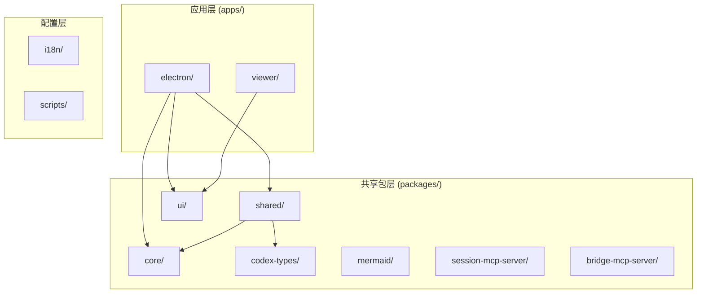
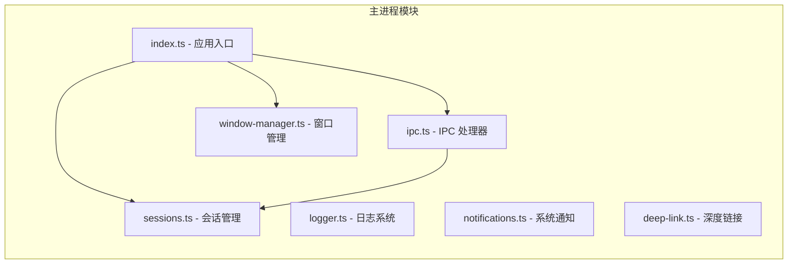
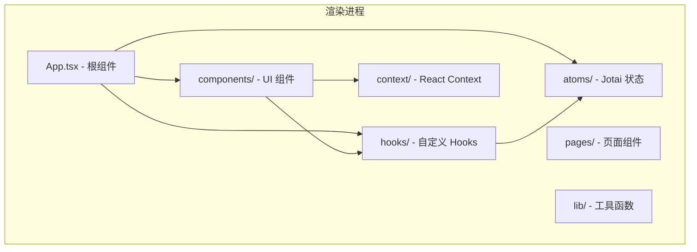
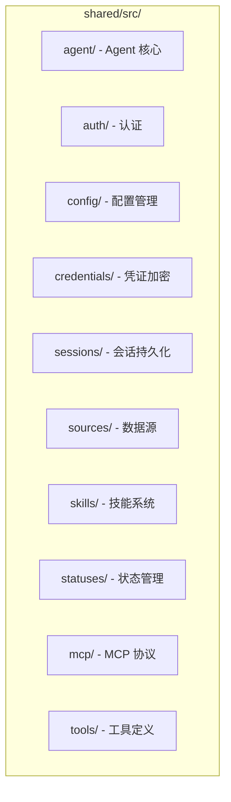

# 代码结构详解

本文档详细介绍各模块的职责和关键文件，帮助你快速定位代码。

## 📋 目录

- [整体结构](#整体结构)
- [Electron 应用层](#electron-应用层)
- [共享包层](#共享包层)
- [关键文件索引](#关键文件索引)

---

## 整体结构



---

## Electron 应用层

### 主进程 (Main Process)

**位置**: `apps/electron/src/main/`

**职责**: 处理系统级操作、文件 I/O、Agent 调用



**关键文件说明：**

| 文件 | 职责 |
|------|------|
| `index.ts` | 应用入口，初始化所有模块 |
| `ipc.ts` | 注册所有 IPC 处理器 |
| `sessions.ts` | 会话创建、删除、消息发送 |
| `window-manager.ts` | 窗口创建、状态管理 |
| `logger.ts` | 日志记录到文件 |
| `notifications.ts` | 系统 OS 通知 |
| `deep-link.ts` | 处理 `craftagents://` URL |

### 预加载脚本 (Preload)

**位置**: `apps/electron/src/preload/`

**职责**: 安全桥接主进程和渲染进程

```typescript
// preload/index.ts 结构
const electronAPI = {
  // 会话相关
  getSessions: () => ipcRenderer.invoke('get-sessions'),
  createSession: (workspaceId) => ipcRenderer.invoke('create-session', workspaceId),
  sendMessage: (sessionId, message, ...) => ipcRenderer.invoke('send-message', ...),
  
  // 工作区相关
  getWorkspaces: () => ipcRenderer.invoke('get-workspaces'),
  switchWorkspace: (id) => ipcRenderer.invoke('switch-workspace', id),
  
  // 配置相关
  getAppTheme: () => ipcRenderer.invoke('get-app-theme'),
  setAppTheme: (theme) => ipcRenderer.invoke('set-app-theme', theme),
  
  // 事件监听
  onSessionEvent: (callback) => {
    const handler = (_, event) => callback(event)
    ipcRenderer.on('session-event', handler)
    return () => ipcRenderer.removeListener('session-event', handler)
  }
}

contextBridge.exposeInMainWorld('electronAPI', electronAPI)
```

### 渲染进程 (Renderer)

**位置**: `apps/electron/src/renderer/`

**职责**: React UI 渲染和用户交互



**关键目录说明：**

| 目录 | 职责 |
|------|------|
| `components/` | 可复用 UI 组件 |
| `hooks/` | 自定义 React Hooks |
| `atoms/` | Jotai 状态原子定义 |
| `pages/` | 页面级组件 |
| `lib/` | 工具函数、路由 |
| `context/` | React Context 定义 |
| `event-processor/` | Agent 事件处理器 |

---

## 共享包层

### @craft-agent/shared

**位置**: `packages/shared/`

**职责**: 核心业务逻辑，可被多个应用使用



**关键模块详解：**

#### agent/ - Agent 核心

```
agent/
├── claude-agent.ts    # Claude Agent 实现
├── codex-agent.ts     # Codex Agent 实现
├── base-agent.ts      # Agent 基类
├── mode-manager.ts    # 权限模式管理
├── permissions-config.ts  # 权限配置
├── session-scoped-tools.ts  # 会话工具
└── backend/           # Agent 后端抽象
```

#### sessions/ - 会话管理

```
sessions/
├── session-store.ts   # 会话存储
├── session-utils.ts   # 会话工具函数
└── types.ts           # 会话类型定义
```

#### sources/ - 数据源

```
sources/
├── source-manager.ts  # 数据源管理器
├── mcp-source.ts      # MCP 数据源
├── api-source.ts      # REST API 数据源
└── local-source.ts    # 本地文件数据源
```

### @craft-agent/core

**位置**: `packages/core/`

**职责**: 核心类型定义，无运行时依赖

```typescript
// 核心类型示例
export interface Session {
  id: string
  workspaceId: string
  name: string
  messages: Message[]
  isProcessing: boolean
  // ...
}

export interface Message {
  id: string
  role: 'user' | 'assistant' | 'system' | 'error'
  content: string
  timestamp: number
  // ...
}
```

### @craft-agent/ui

**位置**: `packages/ui/`

**职责**: 共享 UI 组件库

```
ui/src/
├── components/        # UI 组件
│   ├── button.tsx
│   ├── dialog.tsx
│   ├── input.tsx
│   └── ...
├── lib/              # 工具函数
└── styles/           # 样式文件
```

---

## 关键文件索引

### 按功能分类

#### 会话管理

| 功能 | 文件路径 |
|------|----------|
| 会话类型定义 | `apps/electron/src/shared/types.ts` |
| 会话 Atom | `apps/electron/src/renderer/atoms/sessions.ts` |
| 会话主进程处理 | `apps/electron/src/main/sessions.ts` |
| 会话持久化 | `packages/shared/src/sessions/` |

#### 消息处理

| 功能 | 文件路径 |
|------|----------|
| 消息发送 | `apps/electron/src/renderer/App.tsx` (handleSendMessage) |
| 事件处理 | `apps/electron/src/renderer/event-processor/` |
| 消息组件 | `apps/electron/src/renderer/components/MessageBubble.tsx` |

#### 权限管理

| 功能 | 文件路径 |
|------|----------|
| 权限模式定义 | `packages/shared/src/agent/plan-types.ts` |
| 模式管理器 | `packages/shared/src/agent/mode-manager.ts` |
| 权限对话框 | `apps/electron/src/renderer/components/PermissionDialog.tsx` |

#### 数据源

| 功能 | 文件路径 |
|------|----------|
| 数据源类型 | `packages/shared/src/sources/types.ts` |
| 数据源管理 | `packages/shared/src/sources/source-manager.ts` |
| 数据源 UI | `apps/electron/src/renderer/components/SourcesPanel.tsx` |

#### 技能系统

| 功能 | 文件路径 |
|------|----------|
| 技能类型 | `packages/shared/src/skills/types.ts` |
| 技能管理 | `packages/shared/src/skills/skill-manager.ts` |
| 技能 UI | `apps/electron/src/renderer/components/SkillsPanel.tsx` |

### 按开发场景分类

#### 我想修改 UI 样式

1. 找到对应组件: `apps/electron/src/renderer/components/`
2. 修改 Tailwind 类名
3. 全局样式: `apps/electron/src/renderer/index.css`

#### 我想添加新的 IPC 通信

1. 主进程处理: `apps/electron/src/main/ipc.ts`
2. 预加载脚本: `apps/electron/src/preload/index.ts`
3. 渲染进程调用: 在组件或 Hook 中使用 `window.electronAPI.xxx()`

#### 我想添加新的 Agent 工具

1. 工具定义: `packages/shared/src/tools/`
2. 工具处理: `packages/shared/src/agent/session-scoped-tools.ts`
3. Agent 集成: `packages/shared/src/agent/claude-agent.ts`

---

## 下一步

- 阅读 [修改功能指南](./MODIFYING_FEATURES.md) 学习修改代码
- 阅读 [添加新功能指南](./ADDING_FEATURES.md) 学习开发新功能
- 阅读 [调试指南](./DEBUGGING.md) 解决开发中的问题
