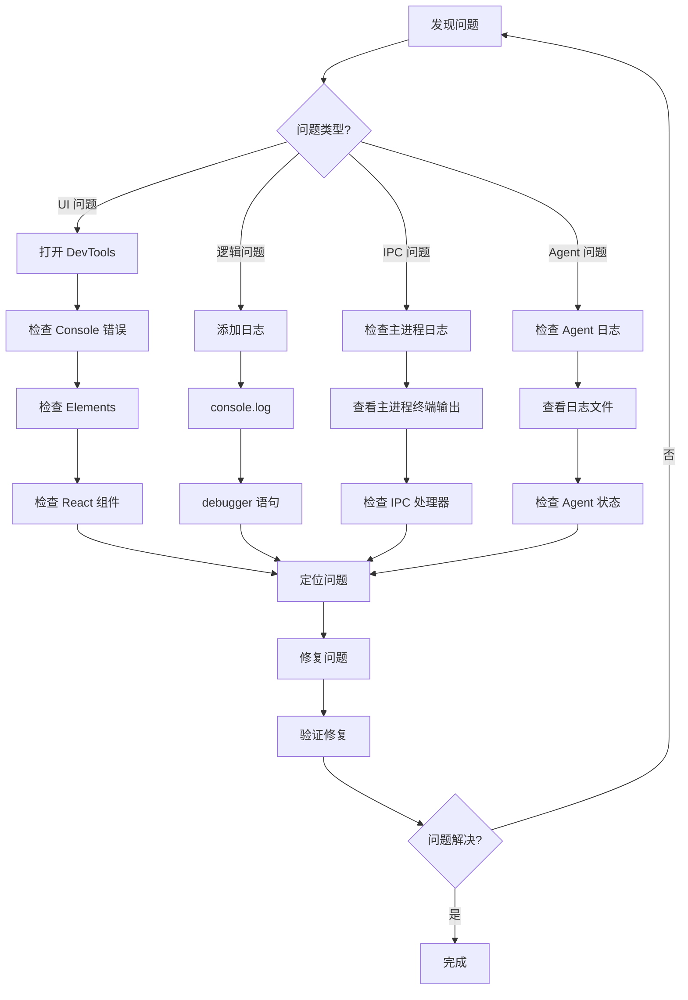
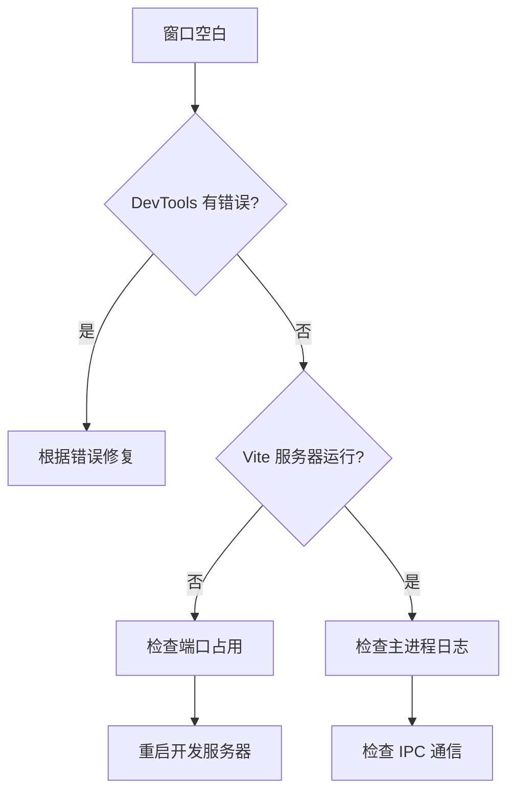
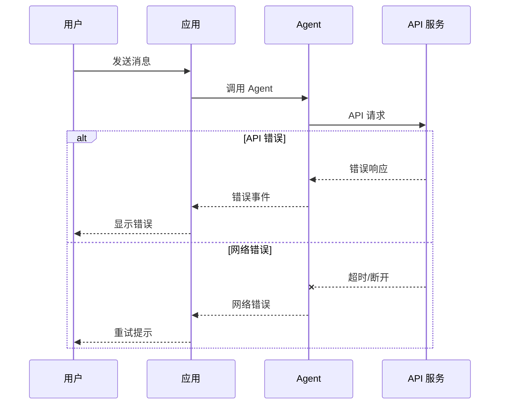
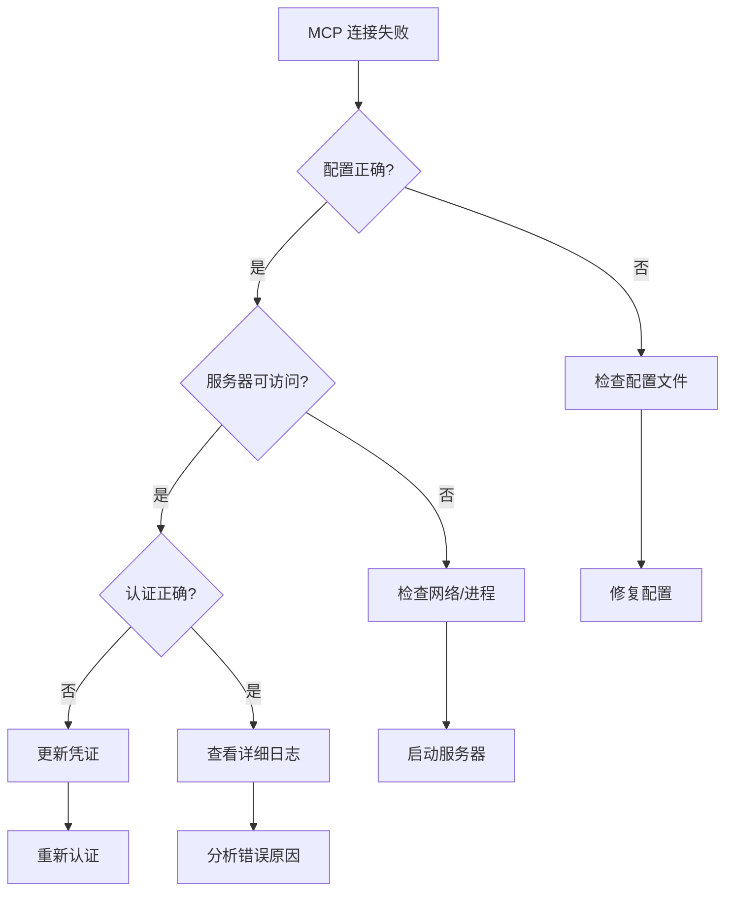
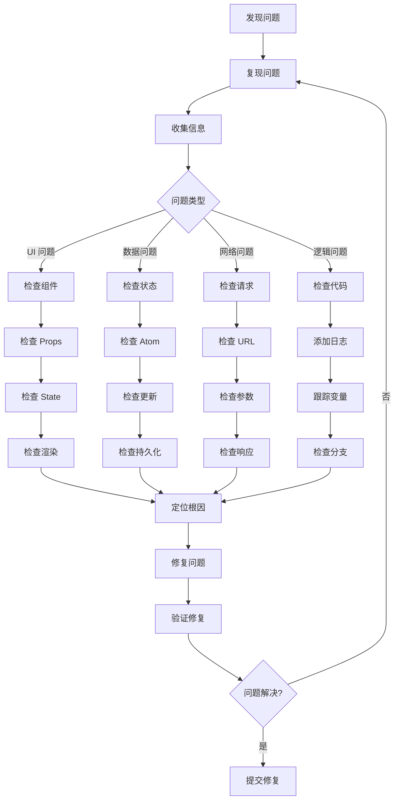

# 常见问题与调试指南

本文档帮助你解决开发过程中遇到的常见问题。

## 📋 目录

- [调试工具](#调试工具)
- [日志系统](#日志系统)
- [常见问题解答](#常见问题解答)
- [调试流程](#调试流程)

---

## 调试工具

### Chrome DevTools

在应用中按 `Cmd+Option+I` (macOS) 或 `Ctrl+Shift+I` (Windows/Linux) 打开开发者工具。

**常用功能：**
- **Console**: 查看日志和错误
- **Network**: 查看网络请求
- **React DevTools**: 检查组件树和状态
- **Elements**: 检查 DOM 和样式

### VS Code 调试配置

创建 `.vscode/launch.json`：

```json
{
  "version": "0.2.0",
  "configurations": [
    {
      "name": "Debug Electron Main",
      "type": "node",
      "request": "launch",
      "cwd": "${workspaceFolder}",
      "runtimeExecutable": "${workspaceFolder}/node_modules/.bin/electron",
      "args": ["."],
      "outputCapture": "std",
      "sourceMaps": true
    },
    {
      "name": "Debug Renderer",
      "type": "chrome",
      "request": "launch",
      "url": "http://localhost:5173",
      "webRoot": "${workspaceFolder}/apps/electron/src/renderer"
    }
  ]
}
```

### 调试流程图



---

## 日志系统

### 日志位置

| 系统 | 日志路径 |
|------|----------|
| **macOS** | `~/Library/Logs/Craft Agents/` |
| **Windows** | `%USERPROFILE%\AppData\Roaming\Craft Agents\logs\` |
| **Linux** | `~/.config/craft-agents/logs/` |

### 日志文件说明

| 文件 | 内容 |
|------|------|
| `main.log` | 主进程日志 |
| `renderer.log` | 渲染进程日志 |
| `agent.log` | Agent 交互日志 |

### 查看实时日志

**macOS:**
```bash
tail -f ~/Library/Logs/Craft\ Agents/main.log
```

**Windows (PowerShell):**
```powershell
Get-Content "$env:APPDATA\Craft Agents\logs\main.log" -Wait
```

**Linux:**
```bash
tail -f ~/.config/craft-agents/logs/main.log
```

### 添加自定义日志

```typescript
// 在主进程中
import { logger } from './logger'

logger.info('操作成功', { sessionId, result })
logger.error('操作失败', { error: error.message })
logger.debug('调试信息', { data })

// 在渲染进程中
console.log('[Debug] 信息:', data)
```

---

## 常见问题解答

### 安装和启动问题

#### Q: `bun install` 失败

**解决方案：**
```bash
# 清除缓存
bun pm cache rm

# 删除依赖
rm -rf node_modules bun.lock

# 重新安装
bun install
```

#### Q: Electron 窗口空白

**排查步骤：**



**解决方案：**
1. 打开 DevTools 检查控制台错误
2. 确认 Vite 开发服务器已启动 (端口 5173)
3. 检查终端是否有错误输出

#### Q: Windows 上 PowerShell 脚本无法执行

**解决方案：**
```powershell
# 修改执行策略
Set-ExecutionPolicy -ExecutionPolicy RemoteSigned -Scope CurrentUser
```

### 运行时问题

#### Q: API 调用返回错误

**排查流程：**



**检查清单：**
- [ ] API Key 是否正确配置
- [ ] 网络连接是否正常
- [ ] API 配额是否用尽
- [ ] 查看日志中的详细错误信息

#### Q: 会话数据丢失

**可能原因：**
1. 工作区切换
2. 文件系统权限问题
3. 磁盘空间不足

**解决方案：**
```bash
# 检查数据目录
ls -la ~/.craft-agent/workspaces/

# 检查磁盘空间
df -h

# 检查文件权限
chmod -R 755 ~/.craft-agent/
```

#### Q: MCP 服务器连接失败

**排查步骤：**



### 开发问题

#### Q: 热重载不工作

**解决方案：**
1. 检查 Vite 配置是否正确
2. 确认文件监听数量限制 (Linux)
3. 重启开发服务器

```bash
# Linux 增加文件监听数量
echo fs.inotify.max_user_watches=524288 | sudo tee -a /etc/sysctl.conf
sudo sysctl -p
```

#### Q: TypeScript 类型错误

**解决方案：**
```bash
# 运行类型检查
bun run typecheck:all

# 查看具体错误
# 根据错误信息修复类型定义
```

#### Q: IPC 通信失败

**调试方法：**

```typescript
// 主进程：添加日志
ipcMain.handle('my-channel', async (event, data) => {
  console.log('[IPC] 收到请求:', data)
  try {
    const result = await doSomething(data)
    console.log('[IPC] 返回结果:', result)
    return result
  } catch (error) {
    console.error('[IPC] 处理失败:', error)
    throw error
  }
})

// 渲染进程：添加日志
const result = await window.electronAPI.myChannel(data)
console.log('[Renderer] IPC 结果:', result)
```

---

## 调试流程

### 问题定位流程



### 调试技巧总结

| 技巧 | 适用场景 | 方法 |
|------|----------|------|
| **console.log** | 快速查看变量值 | `console.log('变量:', value)` |
| **debugger** | 逐步执行代码 | 在代码中添加 `debugger` |
| **React DevTools** | 检查组件状态 | 安装 React DevTools 扩展 |
| **Network 面板** | 检查网络请求 | DevTools → Network |
| **日志文件** | 查看历史日志 | 查看 `~/Library/Logs/Craft Agents/` |

---

## 获取帮助

如果以上方法都无法解决问题：

1. **查看项目文档**: `docs/` 目录下的其他文档
2. **搜索 Issues**: 在 GitHub Issues 中搜索类似问题
3. **提交 Issue**: 提供详细的问题描述和复现步骤

**提交 Issue 时请包含：**
- 操作系统和版本
- Node.js/Bun 版本
- 错误信息和日志
- 复现步骤
- 预期行为和实际行为

---

## 下一步

- 阅读 [项目架构概览](./ARCHITECTURE.md) 了解项目结构
- 阅读 [修改功能指南](./MODIFYING_FEATURES.md) 学习修改代码
- 阅读 [添加新功能指南](./ADDING_FEATURES.md) 学习开发新功能
