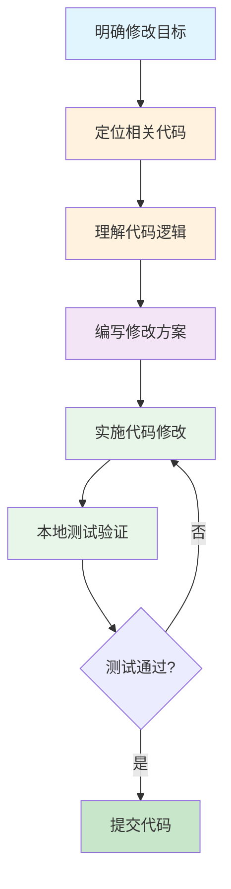
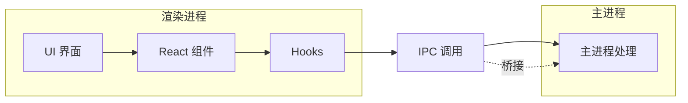
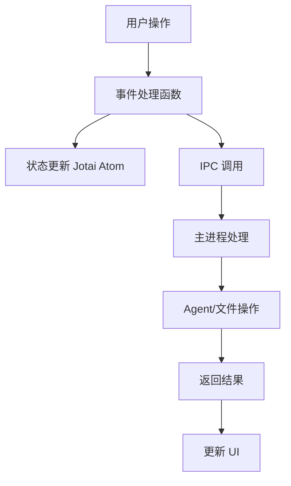
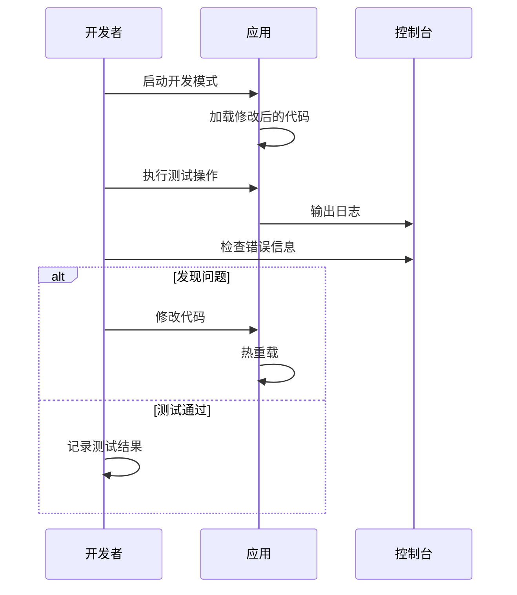
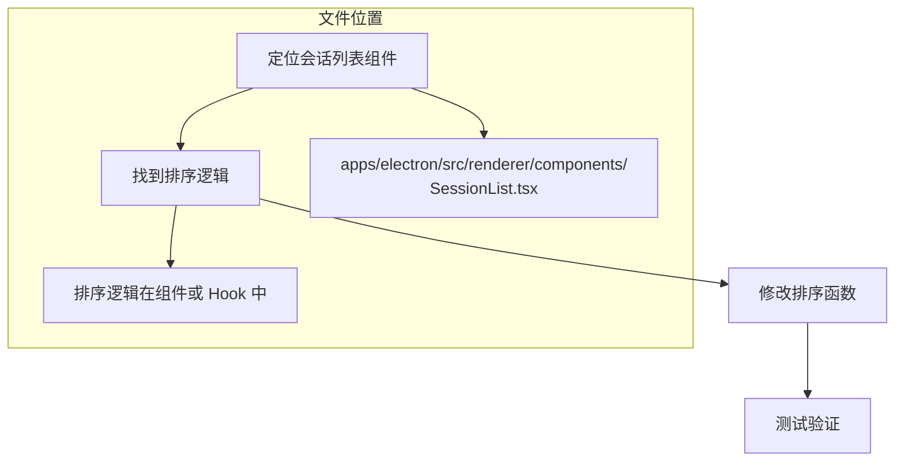
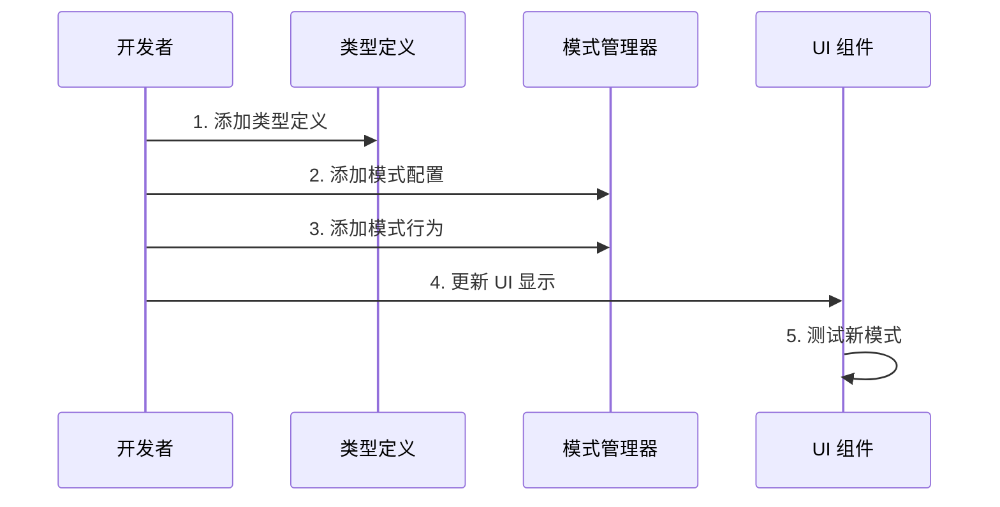

# 修改功能指南

本文档教你如何定位、修改和验证现有功能。

## 📋 目录

- [修改流程概览](#修改流程概览)
- [定位代码](#定位代码)
- [修改代码](#修改代码)
- [测试验证](#测试验证)
- [实战案例](#实战案例)

---

## 修改流程概览



---

## 定位代码

### 方法一：关键词搜索

使用 IDE 的全局搜索功能 (VS Code: `Cmd/Ctrl + Shift + F`)

**搜索技巧：**
- 搜索 UI 文本 (如按钮文字、标签)
- 搜索函数名或变量名
- 搜索 CSS 类名

### 方法二：从 UI 组件入手



**组件位置：**
- UI 组件: `apps/electron/src/renderer/components/`
- 页面组件: `apps/electron/src/renderer/pages/`
- 共享组件: `packages/ui/src/`

### 方法三：从数据流入手



**关键文件：**
- 状态定义: `apps/electron/src/renderer/atoms/`
- IPC 定义: `apps/electron/src/preload/index.ts`
- IPC 处理: `apps/electron/src/main/ipc.ts`

---

## 修改代码

### 修改前检查清单

- [ ] 理解代码的职责和依赖关系
- [ ] 确认修改不会破坏现有功能
- [ ] 准备好测试方案

### 代码修改原则

1. **最小改动原则**: 只修改必要的代码
2. **保持一致性**: 遵循项目代码风格
3. **添加注释**: 复杂逻辑添加说明注释
4. **类型安全**: 保持 TypeScript 类型正确

### 常见修改类型

#### 1. 修改 UI 文本

**位置**: 组件文件或国际化文件

```typescript
// 直接修改组件中的文本
<Button>发送消息</Button>

// 或使用国际化 (推荐)
<Button>{t('common.send')}</Button>
```

**国际化文件位置**: `i18n/` 目录

#### 2. 修改样式

**位置**: 组件文件中的 Tailwind 类名

```tsx
// 修改前
<div className="p-4 bg-white">

// 修改后
<div className="p-6 bg-gray-100 rounded-lg">
```

#### 3. 修改业务逻辑

**位置**: Hooks 或主进程处理函数

```typescript
// 修改前
const handleSubmit = () => {
  sendMessage(content)
}

// 修改后
const handleSubmit = () => {
  if (!content.trim()) {
    toast.error('消息不能为空')
    return
  }
  sendMessage(content)
}
```

---

## 测试验证

### 本地测试流程



### 测试检查清单

- [ ] 功能按预期工作
- [ ] 无控制台错误
- [ ] UI 显示正确
- [ ] 边界情况处理正确
- [ ] 不影响其他功能

### 运行类型检查

```bash
bun run typecheck:all
```

### 运行测试

```bash
bun run test
```

---

## 实战案例

### 案例 1：修改会话列表的默认排序

**目标**: 让会话列表按更新时间倒序排列

**步骤：**



**代码修改：**

```typescript
// 修改前
const sortedSessions = sessions.sort((a, b) => 
  a.createdAt - b.createdAt
)

// 修改后
const sortedSessions = sessions.sort((a, b) => 
  b.lastMessageAt - a.lastMessageAt
)
```

### 案例 2：添加新的权限模式

**目标**: 添加一个新的 "Review" 权限模式

**步骤：**



**涉及的文件：**

1. 类型定义: `packages/shared/src/agent/plan-types.ts`
2. 模式管理: `packages/shared/src/agent/mode-manager.ts`
3. UI 组件: `apps/electron/src/renderer/components/PermissionModeSelector.tsx`

### 案例 3：修改消息发送逻辑

**目标**: 发送消息前验证内容长度

**步骤：**

1. **定位代码**: `apps/electron/src/renderer/App.tsx` 中的 `handleSendMessage`

2. **添加验证**:

```typescript
const handleSendMessage = useCallback(async (
  sessionId: string, 
  message: string,
  // ...
) => {
  // 添加验证逻辑
  const MAX_MESSAGE_LENGTH = 100000
  if (message.length > MAX_MESSAGE_LENGTH) {
    updateSessionById(sessionId, (s) => ({
      messages: [...s.messages, {
        id: generateMessageId(),
        role: 'error' as const,
        content: `消息长度超过限制 (${MAX_MESSAGE_LENGTH} 字符)`,
        timestamp: Date.now()
      }]
    }))
    return
  }
  
  // 原有逻辑...
}, [...])
```

3. **测试验证**: 发送超长消息，确认显示错误提示

---

## 下一步

- 阅读 [添加新功能指南](./ADDING_FEATURES.md) 学习开发新功能
- 阅读 [代码结构详解](./CODE_STRUCTURE.md) 了解各模块细节
- 阅读 [调试指南](./DEBUGGING.md) 解决开发中的问题
