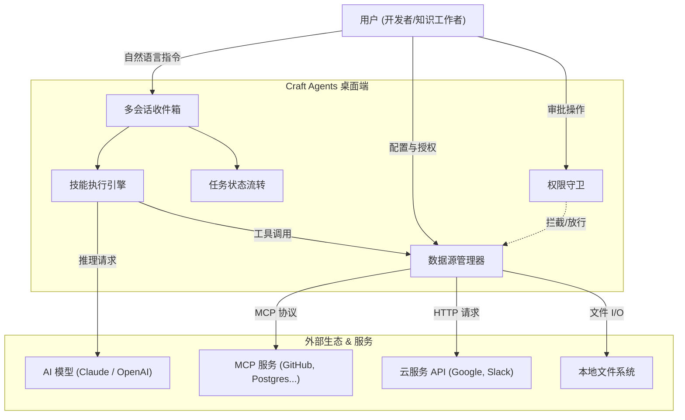
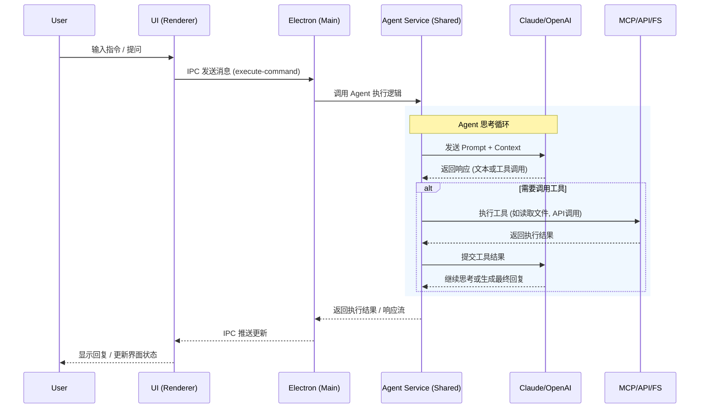

# Craft Agents OSS 项目详细文档

本文档详细介绍了 Craft Agents OSS 项目的业务架构和技术架构。该项目旨在提供一种以文档为中心、Agent 原生的工作流方式，通过直观的桌面应用界面，无缝连接 Claude、Codex 等强大的 AI 模型以及各种外部数据源（MCP、API、本地文件）。

## 1. 项目概述

**Craft Agents** 是一个开源的桌面应用程序，旨在通过提供更高级的交互方式（非纯 CLI）来增强开发者和知识工作者与 AI Agent 的协作效率。

*   **核心理念**: Agent Native Software（Agent 原生软件），强调自然语言交互、上下文感知和自动化。
*   **主要功能**: 多会话管理、动态状态工作流、多源集成（MCP Servers, REST APIs, Filesystem）、技能导入与管理、权限控制等。
*   **目标用户**: 需要高效管理多个 AI 任务、连接私有数据源、并希望拥有优于传统聊天界面的用户体验的开发者和高级用户。

---

## 2. 业务架构 (Business Architecture)

业务架构关注产品的功能模块、用户价值流以及与外部系统的交互。

### 2.1 核心业务能力

1.  **智能会话管理 (Session Management)**
    *   **多任务并行**: 支持同时进行多个 Agent 会话，互不干扰。
    *   **状态流转**: 引入“Todo -> In Progress -> Review -> Done”的任务状态流，通过看板或列表管理。
    *   **持久化**: 会话历史自动保存到本地，支持搜索和回顾。

2.  **全能连接器 (Universal Connector)**
    *   **MCP 集成**: 支持 Model Context Protocol (MCP)，可接入 Craft, Linear, GitHub, Notion 等服务。
    *   **API 集成**: 支持直接连接 Google (Gmail, Calendar, Drive), Slack, Microsoft 等 REST API。
    *   **本地文件**: 直接读取和操作本地文件系统、Git 仓库。

3.  **技能系统 (Skill System)**
    *   **自定义技能**: 用户可以通过自然语言定义特定任务的执行逻辑。
    *   **技能导入**: 支持从 Claude Code 或其他来源导入现有技能。

4.  **安全与权限 (Security & Permissions)**
    *   **三级权限模式**: Safe (只读), Ask (询问), Allow-all (自动执行)。
    *   **凭证加密**: 所有 API Key 和 OAuth Token 均采用 AES-256-GCM 本地加密存储。

### 2.2 业务架构图



---

## 3. 技术架构 (Technical Architecture)

技术架构描述系统的代码组织、技术选型、数据流向及模块间的依赖关系。

### 3.1 技术栈概览

| 层级 | 技术选型 | 说明 |
| :--- | :--- | :--- |
| **Runtime** | Bun | 高性能 JavaScript 运行时，用于构建和脚本执行 |
| **Desktop Shell** | Electron | 跨平台桌面应用框架 |
| **Frontend** | React, Vite, Tailwind CSS v4 | 现代化 UI 开发栈，使用 shadcn/ui 组件库 |
| **Core Logic** | TypeScript | 核心业务逻辑均使用 TypeScript 编写 |
| **AI Integration** | @anthropic-ai/claude-agent-sdk | Anthropic 官方 Agent SDK |
| **Data Storage** | JSON Files, Encrypted Credentials | 本地文件存储配置与会话，AES-256-GCM 加密敏感数据 |

### 3.2 模块划分 (Monorepo Structure)

项目采用 Monorepo 结构管理（基于 Workspaces），主要分为 `apps` 和 `packages`。

*   **apps/**
    *   `electron`: 主桌面应用程序。
        *   `main`: Electron 主进程，处理系统级操作、窗口管理。
        *   `renderer`: React 前端界面，处理用户交互。
        *   `preload`: 用于 Main 和 Renderer 进程通信的 Context Bridge。
    *   `viewer`: Web 版会话查看器，用于分享和回放会话记录。

*   **packages/**
    *   `core`: 全局共享的 TypeScript 类型定义。
    *   `shared`: 核心业务逻辑库（**最关键部分**）。
        *   `agent`: 封装 CraftAgent 类，处理 AI 交互与权限。
        *   `auth`: 处理 OAuth 认证流程。
        *   `config`: 管理配置文件的读写。
        *   `credentials`: 处理敏感信息的加密存储。
        *   `sessions`: 会话数据的持久化与加载。
        *   `sources`: 管理和连接各种数据源 (MCP, API)。
        *   `statuses`: 任务状态管理逻辑。
    *   `ui`: 共享的 UI 组件库。
    *   `codex-types`: Codex 集成相关的类型定义。

### 3.3 数据流与交互图



### 3.4 关键技术实现细节

1.  **通信机制**: 
    *   应用采用 Electron 的 IPC (Inter-Process Communication) 机制连接 UI 层与核心逻辑层。
    *   Preload 脚本通过 `contextBridge` 暴露安全的 API 给渲染进程。

2.  **数据持久化**:
    *   用户数据存储在 `~/.craft-agent/` (macOS/Linux) 或 `%USERPROFILE%/.craft-agent/` (Windows)。
    *   `config.json`: 全局配置。
    *   `credentials.enc`: 加密后的凭证文件。
    *   `workspaces/{id}/`: 每个工作区的独立数据（会话日志、技能、源配置）。

3.  **MCP 集成**:
    *   系统内置了 MCP Client 实现，可以直接启动本地 MCP Server (stdio 模式) 或连接远程 MCP Server。
    *   在启动本地 MCP Server 时，系统会进行环境变量过滤，防止敏感 Key 泄露给子进程。

4.  **查看器 (Viewer)**:
    *   `apps/viewer` 是一个轻量级的 Web 应用，复用了 `packages/ui` 和 `packages/core`，用于加载和渲染导出的会话数据，方便团队协作分享。

## 4. 目录结构说明

```
craft-agents-oss/
├── apps/
│   ├── electron/              # [核心] 桌面客户端应用
│   │   ├── src/main/          # Electron 主进程代码
│   │   ├── src/renderer/      # React 前端代码
│   │   └── src/preload/       # 预加载脚本
│   └── viewer/                # [辅助] Web 会话查看器
├── packages/
│   ├── core/                  # [基础] 共享类型定义
│   ├── shared/                # [核心] 业务逻辑 (Agent, Auth, Config...)
│   ├── ui/                    # [UI] 共享组件库
│   ├── codex-types/           # Codex 类型支持
│   └── mermaid/               # Mermaid 图表支持模块
├── docs/                      # 项目文档
└── README.md                  # 项目说明
```
